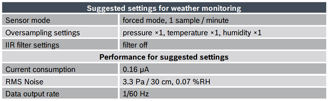

# Lightning_Location_System
This is a joint research between Yasui Laboratory in Nagoya Institute of Technology (Japan) and Chubu Electrical Safety Services Foundation (Japan).

The author of this repository is a PhD student from Nagoya Institute of Technology in this project.
- [Yasui Laboratory (Nagoya Institute of Technology)](http://yasui-lab.web.nitech.ac.jp/)

Since most of the code which control the hardware of the lightning location system in this project are referenced/adjusted from network, so I upload them to this public repository.

The photos of the system in each location is below : 


We use Raspberry Pi 4 Model B (8G) to control this system and upload data to the Google Drive through an LTE module which called 4gpi based on SIM7600 made by MECHATRAX.
- [4gpi Product Introduction (Japanese)](https://mechatrax.com/products/4gpi/)
- [4gpi Github Repository](https://github.com/mechatrax/4gpi)
- [SIM7600 Datasheet](https://www.datasheets.com/en/part-details/sim7600g-simcom-wireless-solutions-415309951#datasheet)

This README file will tell you the function of each script and how to use them.

Here is a figure to explain the data flow of this system:


The linux and python packages used in this project is below :
```
sudo apt install tmux
sudo apt -y install i2c-tools
sudo pip3 install RPi.GPIO
sudo pip3 install smbus
sudo pip3 install smbus2
sudo apt -y install python3-numpy
sudo pip3 install psutil
curl https://rclone.org/install.sh | sudo bash
```

## Index
- [1. Initilization](#1.-Initialization)
- [2. Lightning Sensor Module](#2.-Lightning-Sensor-Module)
  - [2.1 AS3935.py](#2.1-AS3935.py)
  - [2.2 AS3935_Calibration.py](#2.2-AS3935_Calibration.py)
  - [2.3 RPi_AS3935.py](#2.3-RPi_AS3935.py)
- [3. Atmosphere Sensor Module](#3.-Atmosphere-Sensor-Module)
  - [3.1 BME280.py](#3.1-BME280.py)
  - [3.2 RPi_BME280.py](#3.2-RPi_BME280.py)
- [4. System Condition Module](#4.-System-Condition-Module)
- [5. Synchronize With Google Cloud](#5.-Synchronize-With-Google-Cloud)
- [6. Shell Scripts](#6.-Shell-Scripts)
  - [6.1 run.sh](#6.1-run.sh)
  - [6.2 kill.sh](#6.2-kill.sh)
  - [6.3 DeleteData.sh](#6.3-DeleteData.sh)
---

## 1. Initialization
- [CommonParameters.py](./CommonParameters.py) saves parameters that may be usually changed for convenience in this LLS project. It has been imported as `cp` in the program of each module.

  __(Be attention, this script not contains all parameters of each sensor like BME280 which has so many parameters for different environments. If you can not find the parameters that written on the datasheets of the sensors in this script, please check them in the program of each module, especially the files with a head of `Rpi_`.)__

- Before using `CommonParameters.py` to set up your system, I highly recommend you to read the datasheets related to this project.Here is a list of datasheets I suggest you to read :
  - [AS3935](https://datasheetspdf.com/datasheet/AS3935.html)
  - [AS3935 module (Japanese)](https://akizukidenshi.com/catalog/g/gK-08685/) 
  - [BME280](https://www.datasheets.com/en/part-details/bme280-bosch-67258952#datasheet)
  - [BME280 module (Japanese)](https://akizukidenshi.com/catalog/g/gK-09421/) 
  - [MT3333](https://www.datasheets.com/en/part-details/mt3333av-mediatek-424168090#datasheet)
  - [GNSS module (Japanese)](https://akizukidenshi.com/catalog/g/gK-13850/) 
  - [PCA9600](https://www.datasheets.com/en/part-details/pca9600d-nxp-semiconductors-42660407#datasheet)


## 2. Lightning Sensor Module
### 2.1 AS3935.py
[AS3935.py](./AS3935.py) is the main program for AS3935. This program is referenced from the website below :
- [Ishikawa-lab (Japanese)](https://www.ishikawa-lab.com/RasPi_lightning.html)

When lightning comes, the data file `data_as3935.csv` will be overwritten by new data. We use [AS3935_DataVerMan.py](.\AS3935_DataVerMan.py) (2.4) to back up different versions periodically. 

We use I2C bus to let AS3935 communicate with raspberry pi.

As we often need to adjust the parameters `WDTH` and `SREJ` for different electromagnetic environments, so I not use `pip3 install RPi_AS3935` but download from pypi and modified it for adjust `WDTD` and `SREJ` more easily.
- [Original RPi_AS3935.py (pypi)](https://pypi.org/project/RPi_AS3935/)

Therefore, you should use `RPi_AS3935.py` in this repository for this project.


### 2.2 AS3935_Calibration.py
[AS3935_Calibration.py](./AS3935_Calibration.py) is based this the repository below :

- [RaspberryPi-AS3935 (Created by Phil Fenstermacher)](https://github.com/pcfens/RaspberryPi-AS3935/wiki/Calibration-Sample)

From the datasheet of AS39395 :
>The AS3935 uses a loop antenna based on parallel LC resonator. The antenna has to be designed to have its resonance frequency at 500kHz and a quality factor of around 15.
> ...
> It is necessary to tune the antenna with an accuracy of ±3.5% to optimize the performance of the signal validation and distance estimation.

For a better performance of the AS3935, you need to use this program and an oscilloscope (or any devices that can measure the frequency up to 40kHz) to measure the signal output from IRQ can find the number which matches 31.25kHz best.

__(We use the default value of the register REG0x03[7:6] which is 00 to set the division ratio to 16, so the best frequency should around 500/16=31.25kHz)__

### 2.3 RPi_AS3935.py
[RPi_AS3935.py](./RPi_AS3935.py) is a basic class used for interacting with the AS3935 lightning sensor from a Raspberry Pi over I2C.
- [Original RPi_AS3935.py (pypi)](https://pypi.org/project/RPi_AS3935/)

The code for adjusting `WDTH` and `SREJ` outside in this program is below : 
```
def set_WDTH(self, WDTH):
    self.read_data()

    write_WDTH = (self.registers[0x01] & 0xF8) + WDTH
    self.set_byte(0x01, write_WDTH)

def set_SREJ(self, SREJ):
    self.read_data()

    write_SREJ = (self.registers[0x02] & 0xF8) + SREJ
    self.set_byte(0x02, write_SREJ)
```

### 2.4 AS3935_DataVerMan.py
- As the `AS3935.py` uses a watchdog when detecting lightning, it's not easy to let the program save the data matrix periodically for back up multiple versions. 

  I write [AS3935_DataVerMan.py](./AS3935_DataVerMan.py) to create a copy of `data_as3935.csv` with a name contains time by a specific time period outside the main program `AS3935.py`. 

- The synchronization cycle is same as other sensors because the `SyncPeriod` is defined in `CommonParameters.py`.

## 3. Atmosphere Sensor Module
### 3.1 BME280.py
[BME280.py](./BME280.py) is the main program for BME280 in this module. This program is also referenced from the Ishikawa-lab :
- [Ishikawa-lab (Japanese)](https://www.ishikawa-lab.com/RasPi_lightning.html)

We use I2C bus to let BME280 communicate with raspberry pi and the suggested settings for weather monitoring is used in this project which you can find in datasheet.



As the [System Condition Module](#4.-System-Condition-Module) (4) also use BME280 to measure the temperature and humidity in the plastic box. I pulled out some common code to `RPi_BME280.py` for simplifying the `BME280.py` and `Condition.py`.

### 3.2 RPi_BME280.py
[RPi_BME280.py](./RPi_BME280.py) is a basic class used for interacting with the BME280 from a Raspberry Pi over I2C.

The program is based on the samples in datasheet.

## 4. System Condition Module 
As the lightning location systems in this project are controlled remotely and 1 of them are very far from our office. We want to know of information of the system in plastic box. 

So in [Condition.py](./Condition.py), we use BME280 to detect the temperature and humidity inside the plastic box, use `psutil` to get the cpu temperature of the raspberry pi.

If the system detected an overheat or continuous high humidity in a long time, it will send a message to us.

__(For some reasons, the program for sending notifications could not be set as public)__

On the PCB of this module, we add a button (the red button on the up-left of the module in the photo) for running `sudo halt` on raspberry pi when we need to shut down the system without using a computer.

## 5. Synchronize With Google Cloud 
In this project, we use `rclone` to synchronize with Google Drive in [Sync.py](./Sync.py).

The synchronization cycle is set to half of `SyncPeriod` defined in `CommonParameters.py`.

__I recommend you to creat the destination folders in the cloud before the first synchronization that you can check whether the path is right when first running.__

## 6. Shell Scripts
### 6.1 run.sh
- [run.sh](./run.sh) can run all modules in several seperate tmux sessions.

- A `git pull origin main` on the head is for getting the latest version of scirpts before running.

- Use `echo` before python command in `bme280` and `condition` sessions for prevent some unexpected close of sessions caused by the sensor of BME280.

- You can let this script run at the startup. However, be attention that as `Sync.py` run the sychronization process immediately after the startup, you need to wait for the connection of network. Here is a sample by using `systemd` to run `run.sh` after the connection established when boot up. 
    1. Create a service called `RunLLS`
    ```
    $ sudo nano  /lib/systemd/system/RunLLS.service
    ```
    2. Add the following text, use `network-online.target` for running the script after network established
       
       __(The file `RunLLS.service` can be found in the folder `SetStartupRunning`, you can copy it to `~/lib/systemd/system/`)__
    ```
    [Unit]
    Description=My Script Service
    Wants=network-online.target
    After=network-online.target
    
    [Service]
    Type=simple
    User=pi
    ExecStart=/bin/sh /home/pi/Lightning_Location_System/run.sh
    RemainAfterExit=true

    [Install]
    WantedBy=multi-user.target
    ```
   3. Set priorities
    ```
    $ sudo chmod 744 /home/pi/Lightning_Location_System/run.sh
    $ sudo chmod 664 /lib/systemd/system/RunLLS.service
    $ sudo systemctl daemon-reload
    ```
   4. Enable services
    ```
    $ sudo systemctl enable systemd-networkd
    $ sudo systemctl enable RunLLS.service
    ```
   5. Reboot to test
    ```
    $ sudo reboot
    ```
  __You can use `SetStartupRunning.sh` in the folder `SetStartupRunning` to run the commands from step 3 to 5__

### 6.2 kill.sh
[kill.sh](./kill.sh) can all tmux sessions.
You can specify the sessions you want to kill in this script.

### 6.3 DeleteData.sh
[DeleteData.sh](./DeleteData.sh) can delete all data in the local folders when debug program.

You should confirm your action before the deletion. (Input `Y` to confirm)

__<span style="color: red; ">But be attention!!! This is very dangerous when you have old data on the cloud especially when `Sync.py` is running. </span>__

__<span style="color: red; ">I highly recommend you to check the data on the cloud and backup the data whether it's really useful before the deletion. </span>__

## 7 Update logs
### 20222/06/02 (Thursday)
1. AS3935.py
